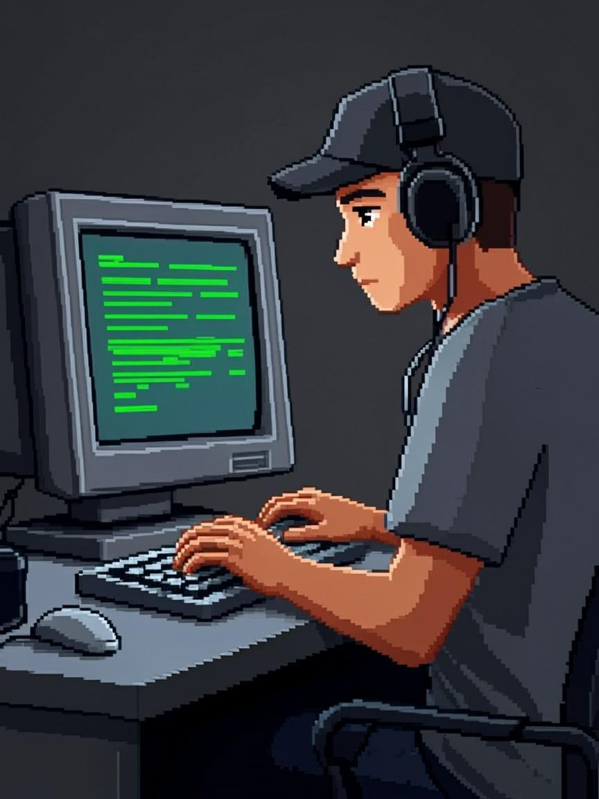

 

# Hi 👋, I'm Mayank Bhaskar

### AI & Full-Stack Developer

  <em>Building useful tools across AI, automation &amp; open source.</em>

---

## 🚀 About Me

<table>
<tr>
<td width="65%" valign="top">

**Mayank here** — an ADHD-powered builder obsessed with turning random ideas into useful software. I work across **AI, full-stack, automation and open source**, and I'd rather ship a real product than talk about one.

I enjoy building **scalable, production-ready tools** with clean architecture — from desktop apps to automation pipelines to developer CLIs. Every project is a chance to learn something new and make it real.

Currently deep in **Next.js, PostgreSQL, Rust and AI/ML**, sharpening my problem-solving skills by building and shipping constantly.

My goal is simple: **write clean code, ship useful things, and build software that lasts.**

</td>
<td width="35%" valign="top" align="center">

</td>
</tr>
</table>

---

## 🤝 Connect

  &nbsp;&nbsp;&nbsp;
  &nbsp;&nbsp;&nbsp;
  &nbsp;&nbsp;&nbsp;
  &nbsp;&nbsp;&nbsp;
  &nbsp;&nbsp;&nbsp;
  

---

## 💻 Tech Stack

  

---

## 📊 GitHub Stats

---

## 📈 Activity Graph

---

Building useful tools, experimenting with AI, automation &amp; open source.

