<div align="center">



</div>

<br/>

<div align="center">

<a href="https://github.com/indiancybersecz">
  
</a>

<br/>

> _Building useful tools across **AI, automation & open source**._
> _I'd rather ship a real product than talk about one._

</div>

<p align="center"></p>

<!-- Quick-stats badge row — auto-updating social proof -->
<div align="center">

<a href="https://github.com/indiancybersecz?tab=followers"></a>
<a href="https://github.com/indiancybersecz?tab=repositories"></a>
<a href="https://github.com/indiancybersecz"></a>
<a href="https://github.com/indiancybersecz"></a>
<a href="#"></a>

</div>

<p align="center"></p>

## 🚀 About Me

<table>
<tr>
<td width="65%" valign="top">

**Mayank here** — an ADHD-powered builder obsessed with turning random ideas into useful software. I work across **AI, full-stack, automation and open source**, and I'd rather ship a real product than talk about one.

I enjoy building **scalable, production-ready tools** with clean architecture — from desktop apps to automation pipelines to developer CLIs. Every project is a chance to learn something new and make it real.

Currently deep in **Next.js, PostgreSQL, Rust and AI/ML**, sharpening my problem-solving skills by building and shipping constantly.

My goal is simple: **write clean code, ship useful things, and build software that lasts.**

</td>
<td width="35%" valign="top" align="center">


</td>
</tr>
</table>

<p align="center"></p>

## 📍 NOW

```yaml
currently_shipping: migrating repos to this account + scaling mayaroute's provider matrix
currently_learning:  Rust async patterns, MCP server protocol, RAG eval methodologies
currently_exploring: AI red-teaming tooling, local-first LLM routers, indie OSS monetization
open_to:             collaborations on AI tooling, OSS contributions, indie dev partnerships
last_updated:        2026-09-30
```

<sub>_Refresh this section every 2-4 weeks so visitors see momentum._</sub>

<p align="center"></p>

## 🚀 Featured Projects

_Active dev tooling on this account — featured cards land here as each repo goes live._

<table>
<tr>
<td width="50%" valign="top" align="center">
  <a href="https://github.com/indiancybersecz/hearth"></a><br/>
  <sub><a href="https://github.com/indiancybersecz/hearth">🔥 Three-pane desktop YouTube Music player — synced lyrics, crossfade, Discord RPC, plugin system</a></sub><br/>
  <sub><b>★ star · view repo →</b></sub>
</td>
<td width="50%" valign="top" align="center">
  <a href="https://github.com/indiancybersecz?tab=repositories"><br/><sub>Free AI gateway (OpenAI-compatible)</sub></a>
</td>
</tr>
<tr>
<td width="50%" valign="top" align="center">
  <a href="https://github.com/indiancybersecz?tab=repositories"><br/><sub>Free worldwide scam scanner</sub></a>
</td>
<td width="50%" valign="top" align="center">
  <a href="https://github.com/indiancybersecz?tab=repositories"><br/><sub>AI-native Linux terminal in browser</sub></a>
</td>
</tr>
</table>

<p align="center"></p>

## 🤝 Connect

<p align="center">
  <a href="https://github.com/indiancybersecz"></a>&nbsp;&nbsp;&nbsp;
  <a href="https://x.com/mayankbhaskarr"></a>&nbsp;&nbsp;&nbsp;
  <a href="https://www.youtube.com/@IndianCyberSecurity"></a>&nbsp;&nbsp;&nbsp;
  <a href="https://t.me/ExploitArc"></a>&nbsp;&nbsp;&nbsp;
  <a href="https://discord.gg/Rk66PWavc"></a>&nbsp;&nbsp;&nbsp;
  <a href="mailto:mayankbhaskardev@gmail.com"></a>
</p>

<p align="center"></p>

## 💻 Tech Stack

<!-- Scrolling marquee of the tech stack -->
<p align="center">
  
</p>

<details open>
<summary><b>Languages</b></summary>
<br/>
<p align="center">
  
</p>
</details>

<details open>
<summary><b>Frameworks & Libraries</b></summary>
<br/>
<p align="center">
  
</p>
</details>

<details open>
<summary><b>Databases & DevOps</b></summary>
<br/>
<p align="center">
  
</p>
</details>

<details open>
<summary><b>Tools</b></summary>
<br/>
<p align="center">
  
</p>
</details>

<p align="center"></p>

## 📊 GitHub Stats

<div align="center">

<!-- FIXED: simpler URL without custom color params that were causing 400s -->


</div>

<p align="center"></p>

## 📈 Activity Graph

<div align="center">

<!-- FIXED: simpler URL without custom color params -->


</div>

<p align="center"></p>

<div align="center">

<!-- FIXED: simpler visitor counter URL -->


<br/><br/>

### _Build. Ship. Repeat._

<sub>Building useful tools, experimenting with AI, automation &amp; open source.</sub>

</div>
